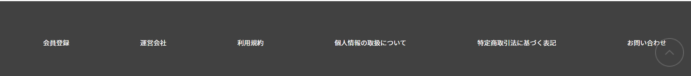
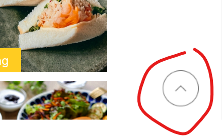
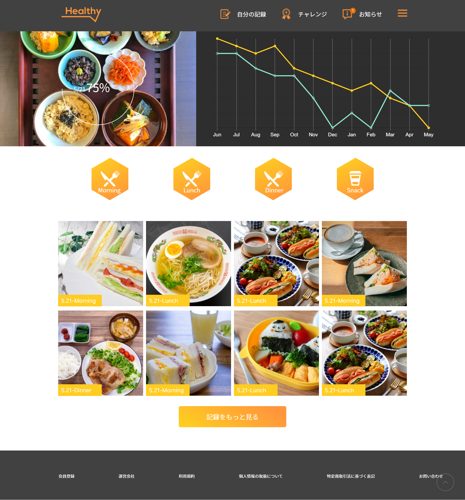
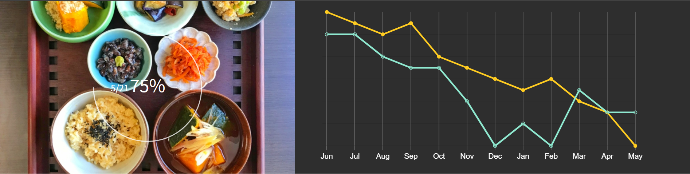
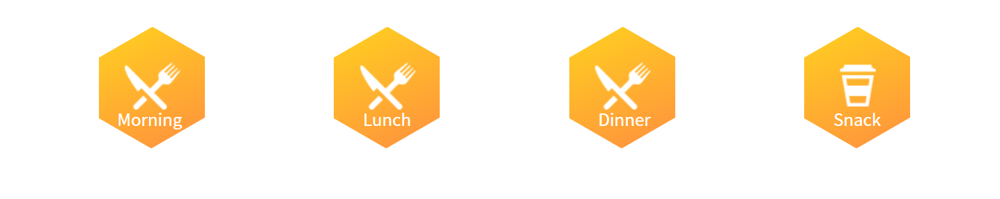
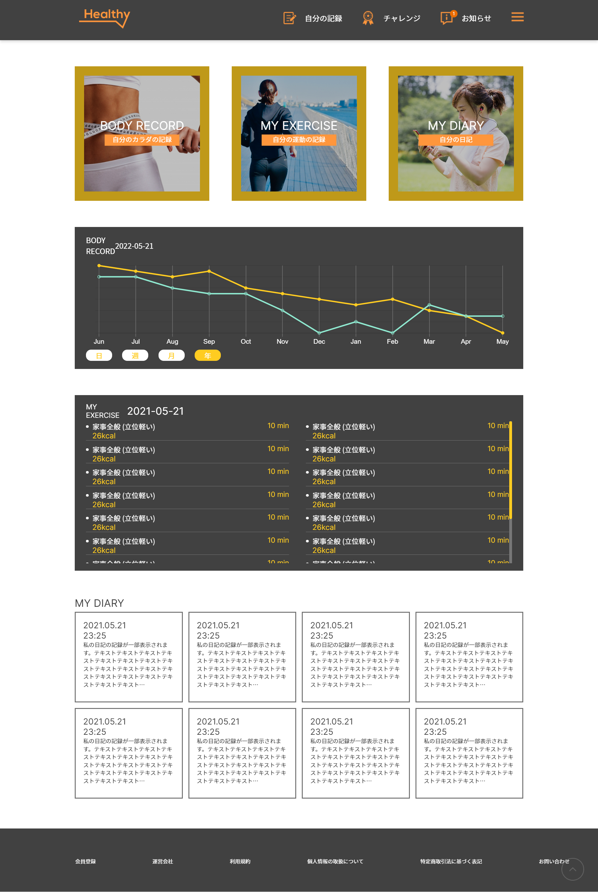
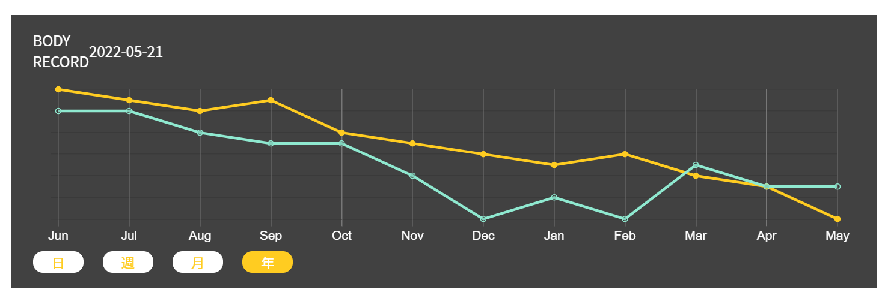
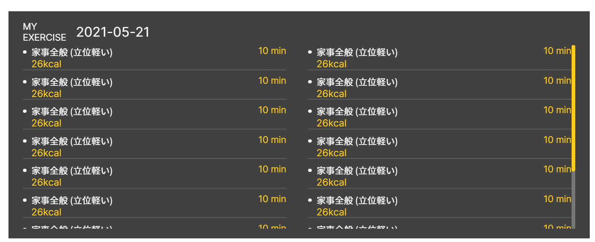
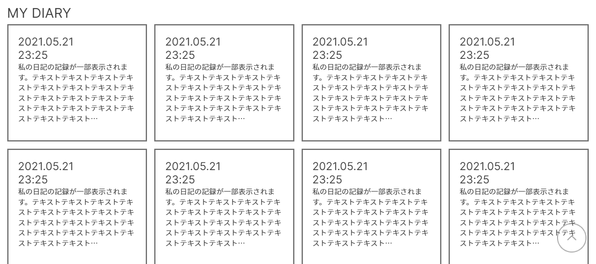
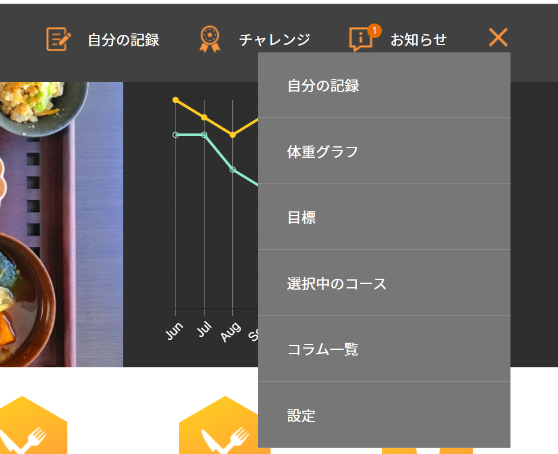

# Healthy App Front-end Codes

# Healthy のフロントエンドコード

## The Project was built by using the ReactJS Framework

## このプロジェクトは ReactJS フレムワックを使って開発しました

## Dependencies & Libraries use in the project

## プロジェクトに利用している Dependencies とライブラリ

- "moment": "^2.29.4",
- "nanoid": "^4.0.0",
- "react": "^18.2.0",
- "react-dom": "^18.2.0",
- "react-chartjs-2": "^4.3.1", -> for displaying the graph （トップとコラムページのライングラフを表示のためライブラリ）
- "react-circular-progressbar": "^2.1.0",-> for display circular progressbar （ライングラフを表示のため）
- "react-router-dom": "^6.3.0", -> for handling the navigation between pages （各ページを遷移するためのライブラリ）

### Photos, pictures, and screen captures img was in src/assets folder

### 画像は src/assets フォルダに保存しております

### MyExerciseData.js, MyRecordDiaryData.js, photoData.js, RecordData.js images link to files in public/images folder

### MyExerciseData.js, MyRecordDiaryData.js, photoData.js, RecordData.js にある画像リンク先は public/images フォルダに保存しております

## Pages & Components & Hooks & Context in the app

## アプリに各ページ、コンポネント、Hooks、Context API の一覧

- NavBar (Component)
  - 
- Footer
  - 
- SeeMoreButton (Component)
  - 
  - See More Button was using in the top page and Column page
  - Top ページとコラムページにあるもっと見るボタンの共通デザインのため、コンポネントとして利用します
- MoveTop (Component)
  - 
  - Move Top Button was using across all of the page
  - （各ページにて下に移動したら、MoveToTop イコンが表示され、クリックしたら Top に戻ります）
- Top (page) (Component)
  - How to access -> Menu -> logo icon and other not existed page
  - アクセス方法メーヌロゴイコンをクリックする）
  - 
  - TopMain (component)
    - 
    - fake data RecordData.js
    - ファクデータ RecordData.js を使って表示してます
  - TopButton (component)
    - 
  - TopPhotos (component)
    - 
    - fake data photoData.js
    - ファクデータ photoData.js を使って表示してます
- - My Record page (page)
  - How to access -> Menu -> 自分の記録
  - 
  - MyRecordRecommend (component)
    - 
  - MyRecordGraph (component)
    - 
    - fake data BodyRecordData.js
    - ファクデータ RecordData.js を使って表示してます
  - MyRecordExercise (component)
    - 
    - fake data MyExerciseData.js
    - ファクデータ MyExerciseData.js を使って表示してます
  - MyRecordDiary (component)
    - 
    - fake data MyExerciseDiaryData.js
    - ファクデータ MyExerciseDiaryData.js を使って表示してます
  - useRecordData (Hooks)
    - This hook was using in the top page record graph and my page body record graph
    - （トップページのグラフと MyRecord ページのグラフを表示するため）
  - useMyRecordData (Hooks)
    - this hook was using only in the record page
    - （MyRecord ページの各 State をハンドリングため使っています）
- Column page (page)
  - How to access -> Hamburger Icon -> コラム一覧
  - アクセス方法ー>Menu からハンバーグイコンをクリックし、コラム-一覧を選択する）
    - 
  - 
  - This page was using Context Api to handling different states to show each categories data
  - （このページは各カテゴリリスト内容を表示のハンドリングため ContextAPI を利用しています）
  - ColumnRecommend (component)
    - 
    - Click each individual recommend category to render different list
    - 各リスト表示するためボタンをクリックする
  - ColumnRecomendList (component)
    - Display base on selected category （選択したレコメンドカテゴリのリスト）
    - 

## Install & Run（インストールと実行手順）

In the project directory, you can run:

### `npm install` to install packages（プロジェクトダイレクトリにて、コマンドラインから`npm install` を実行する）

### `npm start` to start the app in the local host（アップリ起動ため、`npm start`を実行する）

Runs the app in the development mode.\
Open [http://localhost:3000](http://localhost:3000) to view it in your browser.
[http://localhost:3000](http://localhost:3000)を開くアプリを見られるます。
